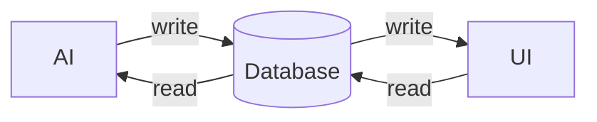
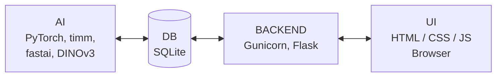
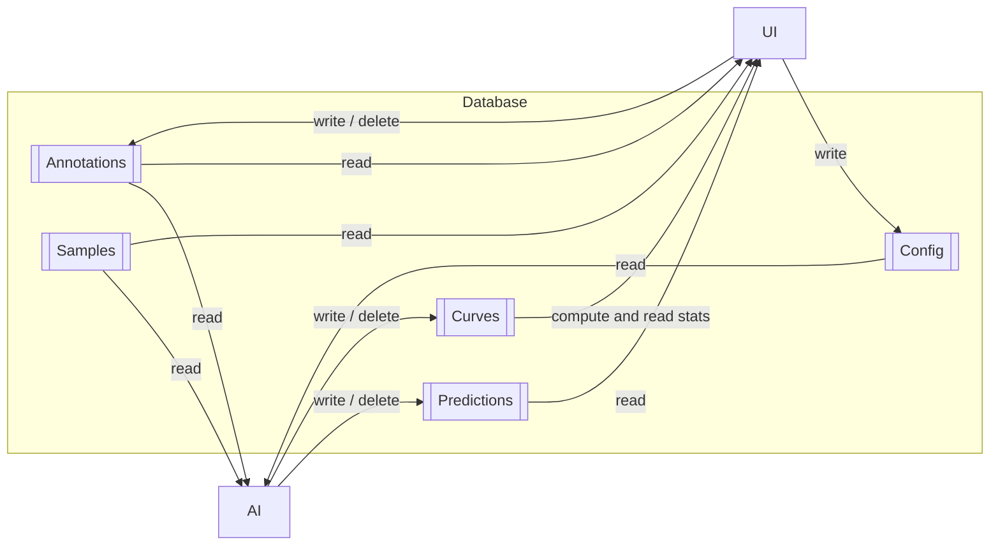
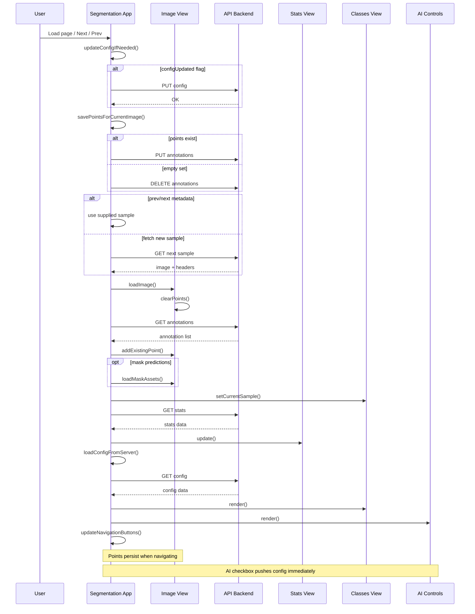

# Level 1: Global

```mermaid
flowchart LR
    AI[AI]
    DB[(Database)]
    UI[UI]

    AI -- write --> DB
    DB -- read --> AI
    DB -- write --> UI
    UI -- read --> DB
```

# Level 2: Technologies

```mermaid
flowchart LR
    AI[AI
    PyTorch, timm, 
    fastai, DINOv3
    ]
    DB[(DB
    SQLite)]
    Backend[BACKEND
    Gunicorn, Flask]
    UI[UI 
    HTML / CSS / JS
    Browser]

    AI <--> DB
    DB <--> Backend
    Backend <--> UI
```

# Level 3: Data Flow

```mermaid
flowchart LR
    subgraph DB [Database]
        direction TB
        Annotations[[Annotations]]
        Samples[[Samples]]
        Config[[Config]]
        Predictions[[Predictions]]
        Curves[[Curves]]
    end

    AI[AI]
    UI[UI]

    Annotations -- read --> AI
    Samples -- read --> AI
    Config -- read --> AI

    AI -- write / delete --> Predictions
    AI -- write / delete --> Curves

    Annotations -- read --> UI
    Predictions -- read --> UI
    Samples -- read --> UI
    Curves -- compute and read stats --> UI

    UI -- write / delete --> Annotations
    UI -- write --> Config
```

# Level 4: Segmentation App Flow
Sequence when the page loads or the user triggers Next/Prev:

```mermaid
sequenceDiagram
    participant User
    participant Frontend as Segmentation App
    participant Canvas as Image View
    participant Server as API Backend
    participant StatsUI as Stats View
    participant ClassesUI as Classes View
    participant AIUI as AI Controls

    User->>Frontend: Load page / Next / Prev
    Frontend->>Frontend: updateConfigIfNeeded()
    alt configUpdated flag
        Frontend->>Server: PUT config
        Server-->>Frontend: OK
    end
    Frontend->>Frontend: savePointsForCurrentImage()
    alt points exist
        Frontend->>Server: PUT annotations
    else empty set
        Frontend->>Server: DELETE annotations
    end
    alt prev/next metadata
        Frontend->>Frontend: use supplied sample
    else fetch new sample
        Frontend->>Server: GET next sample
        Server-->>Frontend: image + headers
    end
    Frontend->>Canvas: loadImage()
    Canvas->>Canvas: clearPoints()
    Frontend->>Server: GET annotations
    Server-->>Frontend: annotation list
    Frontend->>Canvas: addExistingPoint()
    opt mask predictions
        Frontend->>Canvas: loadMaskAssets()
    end
    Frontend->>ClassesUI: setCurrentSample()
    Frontend->>Server: GET stats
    Server-->>Frontend: stats data
    Frontend->>StatsUI: update()
    Frontend->>Frontend: loadConfigFromServer()
    Frontend->>Server: GET config
    Server-->>Frontend: config data
    Frontend->>ClassesUI: render()
    Frontend->>AIUI: render()
    Frontend->>Frontend: updateNavigationButtons()
    Note over Canvas,Frontend: Points persist when navigating
    Note over AIUI,Frontend: AI checkbox pushes config immediately
```
